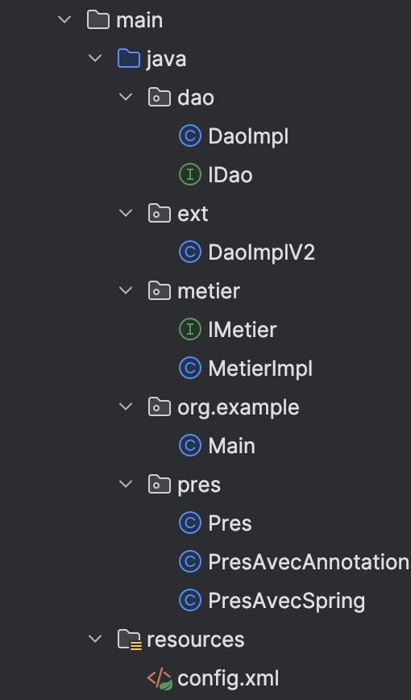
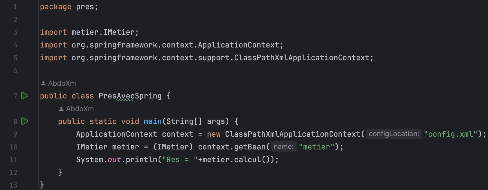
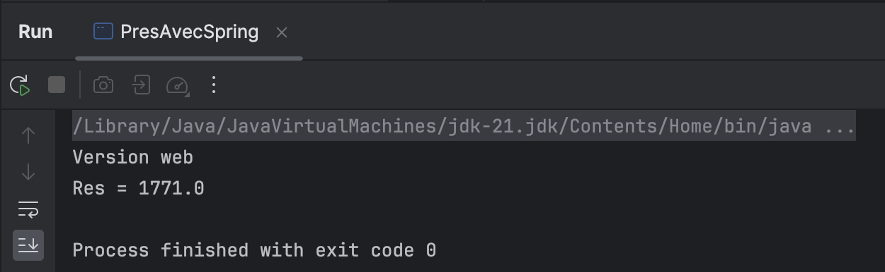
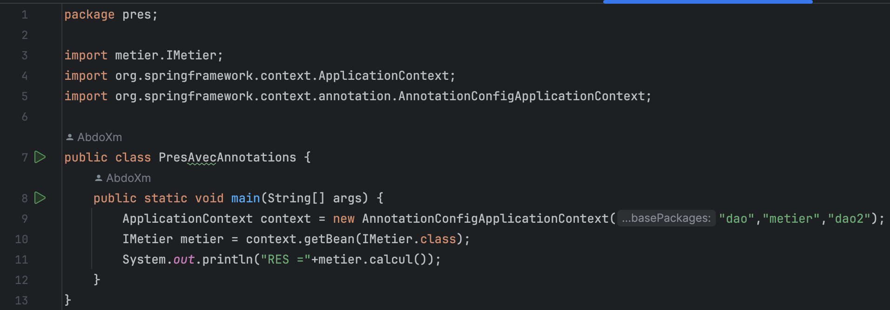
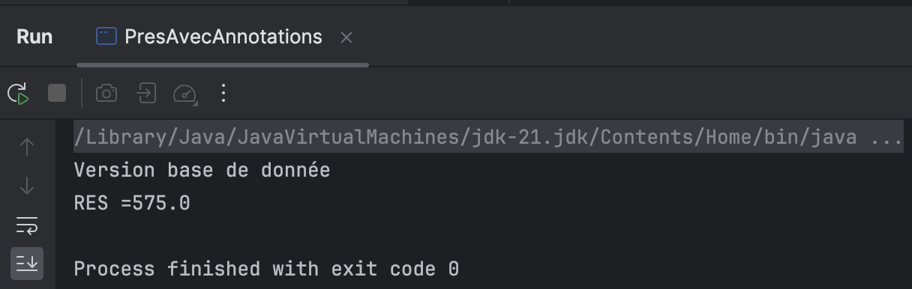
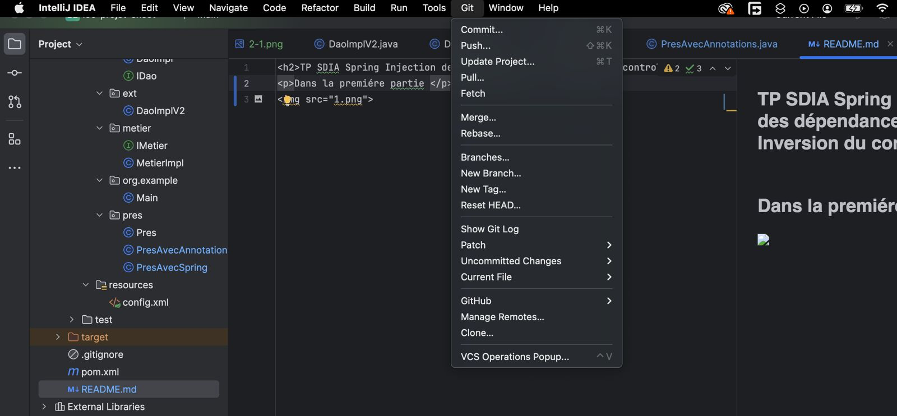

<h2>TP SDIA Spring Injection des dépendances et Inversion du control<h2>

Dans la premiére partie on crée les fichiers avec leurs codage et on aura la structure suivante :

Ensuite on utilisant le sping XML on aura le code et l'affichage suivant :

Aprés en utilisant les annotations on aure le code et l'affichage suivant :

Enfin pour intégrer la version control j'ai utiliser les méthodes inclue dans "Intellij" pour accéder à github afin d'effectuer des "Push" ou "Pull"

